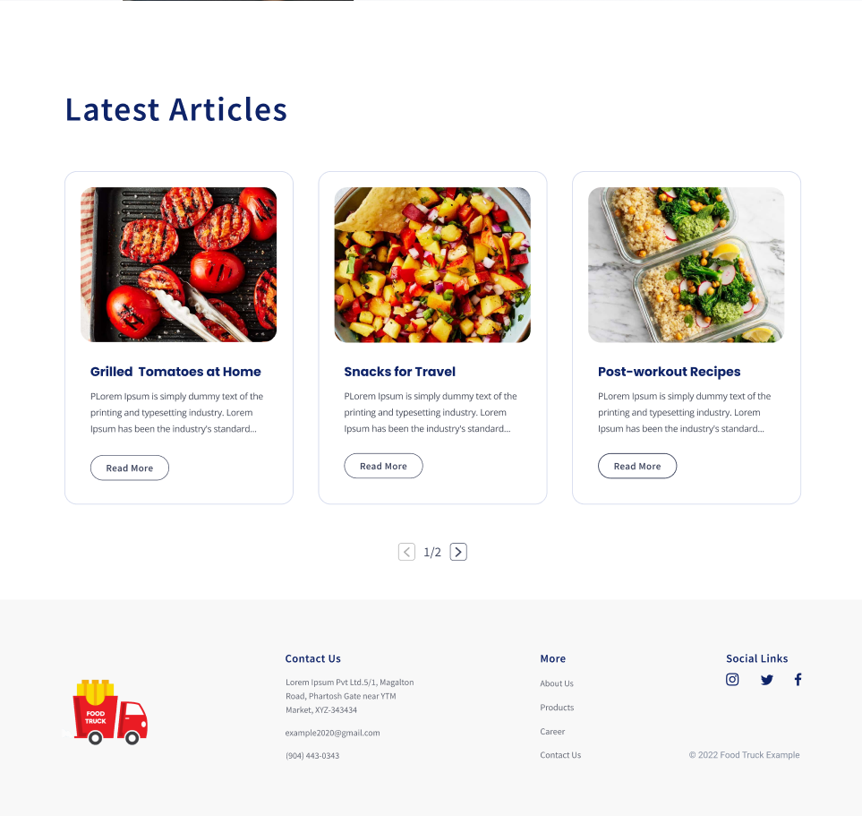

# Food Blogging Website

This webpage is based on a Figma design provided by **The Internet Folks** as part of an assignment.

[View Figma Design](https://www.figma.com/design/Y9eGynqaLzC5mDpypBFFuY/Food-Blogging-Website---TIF-Assignment?node-id=706-490&node-type=frame&t=DxmpxqjHJPK1UCTN-0)

---



---

## Technologies Used

- **React** for building interactive UIs
- **Tailwind CSS** for styling and responsiveness

---

## Features

- User-friendly design and seamless UX
- Fully responsive for all screen sizes
- Includes Hero, About, and Articles sections, along with a Header and Footer
- Pagination implemented for articles to improve navigation and user experience

---

## How to Run This Project Locally

Follow these steps to run the application on your system:

1. Clone this repository:
   ```bash
   git clone https://github.com/moheebk123/Food-Blogging.git
   ```
2. Open the cloned repository in your preferred code editor.
3. Install the necessary dependencies:

   ```bash
   npm install
   ```

4. Start the development server:

   ```bash
   npm run dev
   ```

5. Open your browser and navigate to::

   ```bash
   http://localhost:5173
   ```
